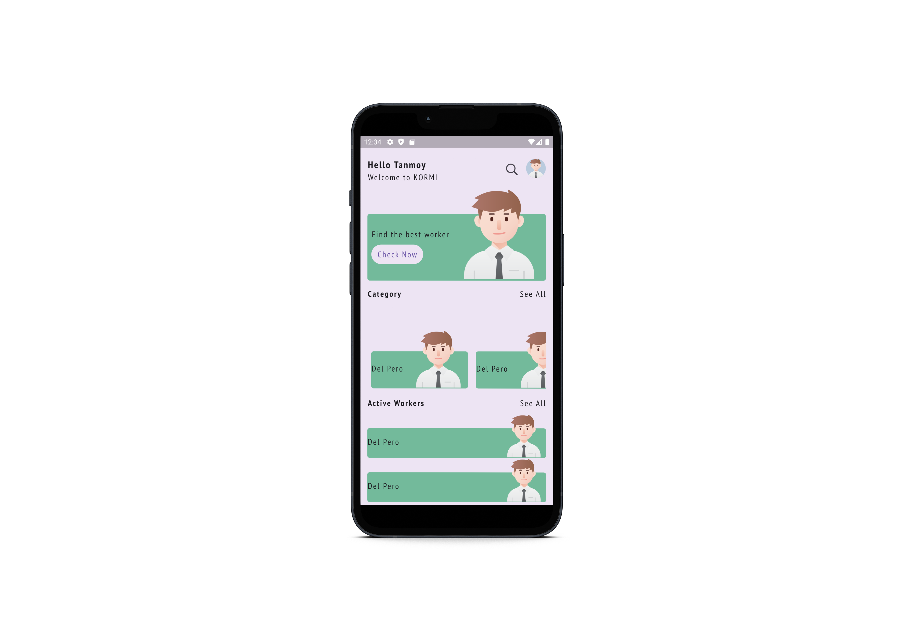

# Kormi UI App

This is a simple UI app built using Flutter. The project is organized into several key folders to maintain a modular structure, making it easy to scale and maintain.

## Preview


## Project Structure

```bash
lib/
├── constants/
│   └── # Contains app-wide constants like colors, fonts, etc.
├── widgets/
│   └── # Reusable UI components used across multiple screens.
├── screens/
│   └── # Screens for various pages of the app.
├── category/
│   └── # Categories and associated components used within the app.
